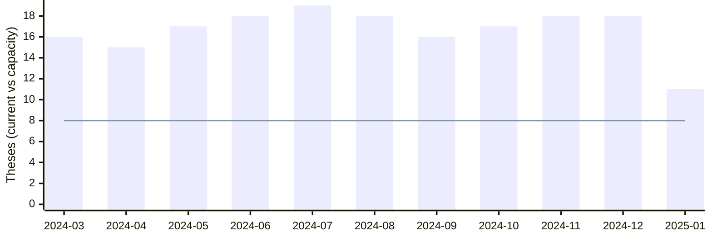

{: .text-center}

```mermaid
---
config:
    xyChart:
        width: 900
        height: 300
---
xychart-beta
    x-axis [2024-03, 2024-04, 2024-05, 2024-06, 2024-07, 2024-08, 2024-09, 2024-10, 2024-11, 2024-12, 2025-01]
    y-axis "Theses (current vs capacity)" 0 --> 19
    bar [16, 15, 17, 18, 19, 18, 16, 17, 18, 18, 11]
    line [8, 8, 8, 8, 8, 8, 8, 8, 8, 8, 8]
```