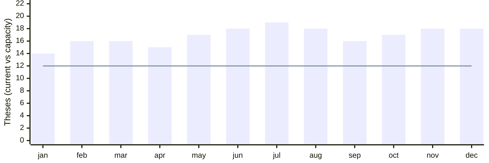

{: .text-center}

```mermaid
---
config:
    xyChart:
        width: 900
        height: 300
---
xychart-beta
    x-axis [jan, feb, mar, apr, may, jun, jul, aug, sep, oct, nov, dec]
    y-axis "Theses (current vs capacity)" 0 --> 22
    bar [14, 16, 16, 15, 17, 18, 19, 18, 16, 17, 18, 18]
    line [12,12,12,12,12,12,12,12,12,12,12,12]
```
