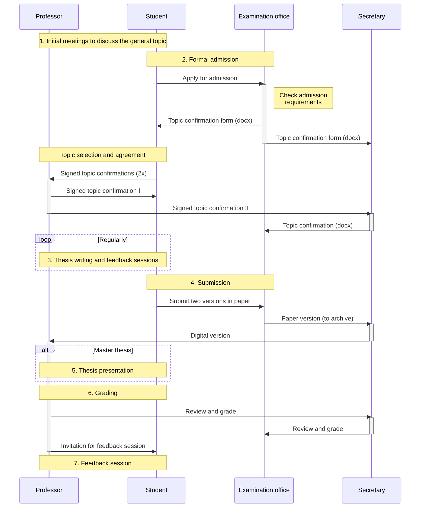

# Process

```mermaid
sequenceDiagram
    Note over Professor,Student: 1. Initial meetings to discuss the general topic
    Note over Student,Examination office: 2. Formal admission
    Student->>Examination office: Apply for admission
    activate Examination office
    Note right of Examination office: Check admission<br/>requirements
    Examination office->>Student: Topic confirmation form (docx)
    Examination office->>Secretary: Topic confirmation form (docx)
    deactivate Examination office
    Note over Professor,Student: Topic selection and agreement
    Student->>Professor: Signed topic confirmations (2x)
    activate Professor
    Professor->>Student: Signed topic confirmation I
    Professor->>Secretary: Signed topic confirmation II
    deactivate Professor
    activate Secretary
    Secretary->>Examination office: Topic confirmation (docx)
    deactivate Secretary
    loop Regularly
        Note over Professor,Student: 3. Thesis writing and feedback sessions
    end
        Note over Student,Examination office: 4. Submission
    Student->>Examination office: Submit two versions in paper
    Examination office->>Secretary: Paper version (to archive)
    activate Secretary
    Secretary->>Professor: Digital version
    deactivate Secretary
    activate Professor
    alt Master thesis
        Note over Professor,Student: 5. Thesis presentation
    end
    Note over Professor,Student: 6. Grading
    Professor->>Secretary: Review and grade
    activate Secretary
    Secretary->>Examination office: Review and grade
    deactivate Secretary
    Professor->>Student: Invitation for feedback session
    deactivate Professor
    Note over Professor,Student: 7. Feedback session
```
