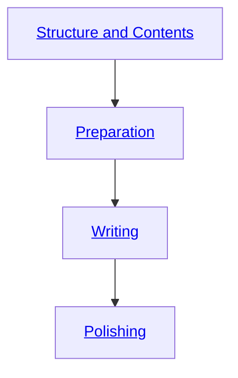

# Writing Guide

Welcome to the Writing Guide! This resource is designed to assist bachelor's and master's students in navigating the thesis writing process from start to finish. Whether you're working on your bachelor's or master's thesis, this guide will walk you through the essential stages to ensure a successful outcome.

## Overview

This overview highlights the typical structure and flow of a research thesis. The thesis process is divided into distinct phases, preparation, writing, and final revisions, which are interconnected and build upon each other.

## Contents

### 1. Structure and Contents
An overview of the typical structure and contents of a research thesis is provided here. The outlined framework may require adjustments to meet the specific needs of the thesis. Each part has a clear purpose, and using an active voice is recommended.
  - Abstract
  - Introduction
  - Background
  - Methodology
  - Results
  - Discussion
  - Conclusion

### 2. Preperation Phase
Guidance on the preparation phase of thesis writing is offered in this section. It outlines key steps and strategies to help students build a strong foundation for their work. Practical advice and recommendations are included to ensure clarity, consistency, and professionalism throughout the writing process.
  - Getting started (Overview, Key Concepts)
  - Five Golden Rules
  - Structuring your thesis (Naming, Checklists)
  - Creating an Outline

### 3. Writing Phase
This section focuses on the writing phase of the thesis. It offers insights into structuring content effectively, ensuring clarity and coherence, and incorporating illustrations appropriately. Following these recommendations will help organize your thesis in a professional manner.
  - Transition from Outline to Text
  - Recommended Writing Sequence
  - Illustrations

### 4. Polishing Phase
The final phase of thesis preparation is covered here, with emphasis on revising, polishing, and ensuring submission readiness. It details important steps to refine content, align visuals, follow language standards, and meet citation guidelines.
  - Revising
  - Finalizing Illustrations
  - Language Guidelines
  - Citation Guidelines
  - Evaluation Criteria

<!--
## Writing: Structure and general writing advice

### What is already there?
[Hanbook Website](https://digital-work-lab.github.io/handbook/docs/20-research/20_processes/20.29.writing.html)
    
    - Structure of contents
    - Writing style
    - Citation style
    - Creating illustrations
    - Reference at the end of the page
[Theses Website](https://digital-work-lab.github.io/theses/)
    
    - only Link to the handbook website
    - Expose
- [Example Structure](https://digital-work-lab.github.io/theses/docs/expose.html)
    
    - Example structure of a bullet point chapter outline

### What is also needed?

    - Five golden rules
    - How to name the sections?
    - When are illustrations needed?
    - How to create the outline?
    - What to put in the outline?
    - How to get from the outline to the text?
    - Which part should you write first?

### Structure

## Page one: **Preparation Phase**

**Laying the Foundation for Your Thesis**

1. **Getting Started**
   - **Overview**
     - **What You’ll Learn**:
       - Structuring your thesis
       - Writing in a clear and concise manner
       - Effectively using illustrations
   - **Key Concepts**
     - **Importance of Structure**: explains why structuring your thesis early on can save time and improve readability
     - **Clarity Over Everything**: emphasizes writing in an accessible way to avoid confusion for readers
     <!--- **Integration with Handbook**: highlights additional resources such as citation style guidelines, writing style recommendations, and tips for creating professional visuals

2. **Five Golden Rules**
   - **Rule 1: Start with a Strong Outline**
     - explains the importance of outlining before starting
     - Outline as the backbone of your thesis
     - provides tips for breaking down your thesis into sections
   - **Rule 2: Maintain Consistency**
     - Consistency in tone: formal, clear, and academic
     - Formatting rules: follow a single style guide for margins, headings, and citations
     - suggests tools like Zotero to help manage citations efficiently
   - **Rule 3: Prioritize Clarity**
     - guides on using short, direct sentences and avoiding unnecessary jargon
     - advises defining technical terms for readers unfamiliar with the topic
   - **Rule 4: Revise Extensively**
     - recommends a multi-step revision process, focusing on structure first, then content, and finally grammar
     - encourages seeking feedback from your supervisor
   - **Rule 5: Use Illustrations Wisely**
     - discusses the purpose of visuals and when to include them (e.g., data-heavy sections, complex processes)
     - warns against overloading the thesis with unnecessary graphics

3. **Structuring Your Thesis**
   - **Section Naming Guide**:
     - *Introduction*: introduces the research problem, objectives, and relevance
     - *Literature Review*/ *Theoretical Background*: summarizes previous research and identifies gaps
     - *Methods*: details the research methodology used
     - *Results*: presents findings clearly and concisely
     - *Discussion*: interprets the results and their implications
     - *Conclusion*: summarizes contributions and suggests areas for further research
   - **Checklist for Key Components**:
     - Research objectives and hypotheses
     - Key literature with citations
     - Research design and methodology
     - Expected outcomes or contributions to the field

4. **Creating an Outline**:
   - creating a general outline for any chapter in a thesis involves structuring the content systematically to ensure clarity, coherence, and alignment with the paper's objectives
   - not really a universal approach due to the different contents of the chapter
   - *links to the "Structuring Your Thesis" section for guidance on creating detailed outlines*

## Page two: **Writing Phase**

**Bringing Your Thesis to Life**

1. **Writing Process**
   - **Transitioning from Outline to Text**
     - *Tips* for expanding bullet points into paragraphs
     - importance of using topic sentences to maintain focus in each paragraph
     - suggestions for integrating references into the text without disrupting flow
   - **Recommended Writing Sequence**
     1. **Methods Section**:
        - easiest section to write first since it’s factual and descriptive
        - sets a foundation for presenting results
     2. **Results Section**:
        - focus on presenting data without interpretation
        - utilize tables, charts, or summarized text as needed
     3. **Discussion Section**:
        - analyzes results in the context of research objectives and questions
        - identifies limitations and discusses implications
     4. **Introduction and Literature Review**:
        - write these later to ensure alignment with what the study achieved
        - contextualize findings and highlight research significance
     5. **Conclusion**:
        - recap key insights and their relevance
        - avoid introducing new ideas or findings

2. **When Are Illustrations Needed?**
   - **Data Presentation**:
     - use charts, graphs, or tables for numerical data
   - **Clarifying Processes**:
     - include flowcharts or diagrams to explain methodologies or workflows
   - **Enhancing Understanding**:
     - use concept maps for theoretical frameworks
   - **Illustration Best Practices**:
     - ensure all visuals are clear, professionally designed, and properly labeled
     - avoid printing large code or class diagrams; focus on architecture and key mechanisms

## Page three: **Finishing Phase**

**Polishing Your Work for Submission**

1. **Revising Extensively**
   - **Step-by-Step Revision Process**:
     - start with structure: Ensure sections flow logically
     - revise content: Improve clarity, coherence, and depth of information
     - finalize language: Check grammar, spelling, and style consistency
   - **Seeking Feedback**:
     - collaborate with peers or supervisors to identify improvement areas

2. **Finalizing Illustrations**
   - **Visual Alignment**:
     - verify that all visuals complement the text and are necessary
     - check for consistency in design style and labeling
   - **Avoid Redundancy**:
     - do not repeat information from visuals in the text unnecessarily
   - **Special Visuals**:
     - use diagrams for system architectures or pseudo-code instead of full code listings

3. **Language Guidelines**
   - **When to Use Present Tense**:
     - general truths or accepted knowledge
     - descriptions of the paper’s content and findings (e.g., “Figure 1 shows…”)
   - **When to Use Past Tense**:
     - descriptions of specific methods, experiments, or results
     - discussion of prior research

4. **Citation Guidelines**
   - **When should you cite directly?**
   - **When should you cite indirectly?**
   - **How does the APA format look?**

-->