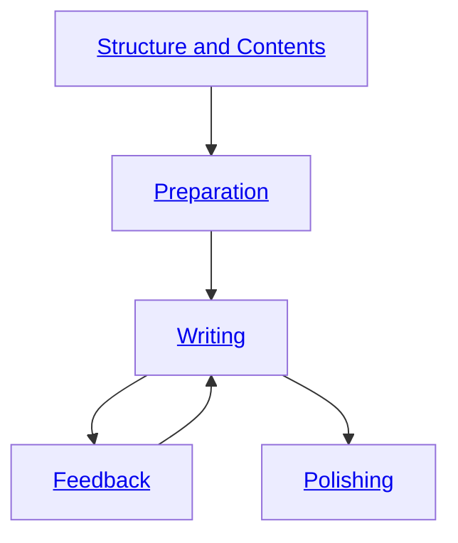

# Writing Guide

Welcome to the Writing Guide!
This resource is designed to assist Bachelor's and Master's students in navigating the thesis writing process from start to finish.
Whether you're working on your Bachelor's or Master's thesis, this guide will walk you through the essential stages to ensure a successful outcome.

## Overview

This overview highlights the typical structure and flow of a research thesis.
The thesis process is divided into distinct phases, preparation, writing, and final revisions, which are interconnected and build upon each other.

{: .text-center}

## Structure and Contents

An overview of the typical structure and contents of a research thesis is provided here.
The outlined framework may require adjustments to meet the specific needs of the thesis.
Each part has a clear purpose, and using an active voice is recommended.

  - Abstract
  - Introduction
  - Background
  - Methodology
  - Results
  - Discussion
  - Conclusion

{: .text-center}
[Learn about structure and contents](writing/structure_and_contents){: .btn .btn-blue target="_blank"}
{: .text-center}

## Preparation Phase

Guidance on the preparation phase of thesis writing is offered in this section.
It outlines key steps and strategies to help students build a strong foundation for their work.
Practical advice and recommendations are included to ensure clarity, consistency, and professionalism throughout the writing process.

  - Getting started
  - Five golden rules
  - Structuring your thesis
  - Creating an outline

{: .text-center}
[Learn about the preparation phase](writing/preparation_phase){: .btn .btn-blue target="_blank"}
{: .text-center}

## Writing Phase

This section focuses on the writing phase of the thesis.
It offers insights into structuring content effectively, ensuring clarity and coherence, and incorporating illustrations appropriately.
Following these recommendations will help organize your thesis in a professional manner.

  - From the outline to the manuscript
  - Recommended writing sequence
  - Illustrations

{: .text-center}
[Learn about the writing phase](writing/writing_phase){: .btn .btn-blue target="_blank"}
{: .text-center}

## Feedback

You can schedule feedback sessions to discuss the current progress, next steps, and current challenges.

{: .text-center}
[Learn about feedback](writing/feedback){: .btn .btn-blue target="_blank"}
{: .text-center}

## Polishing Phase

The final phase of thesis preparation is covered here, with emphasis on revising, polishing, and ensuring readiness for submission.
It details important steps to refine content, align visuals, follow language standards, and meet citation guidelines.

  - Revising
  - Finalizing illustrations
  - Language guidelines
  - Citation guidelines
  - Evaluation criteria

{: .text-center}
[Learn about the polishing phase](writing/polishing){: .btn .btn-blue target="_blank"}
{: .text-center}
