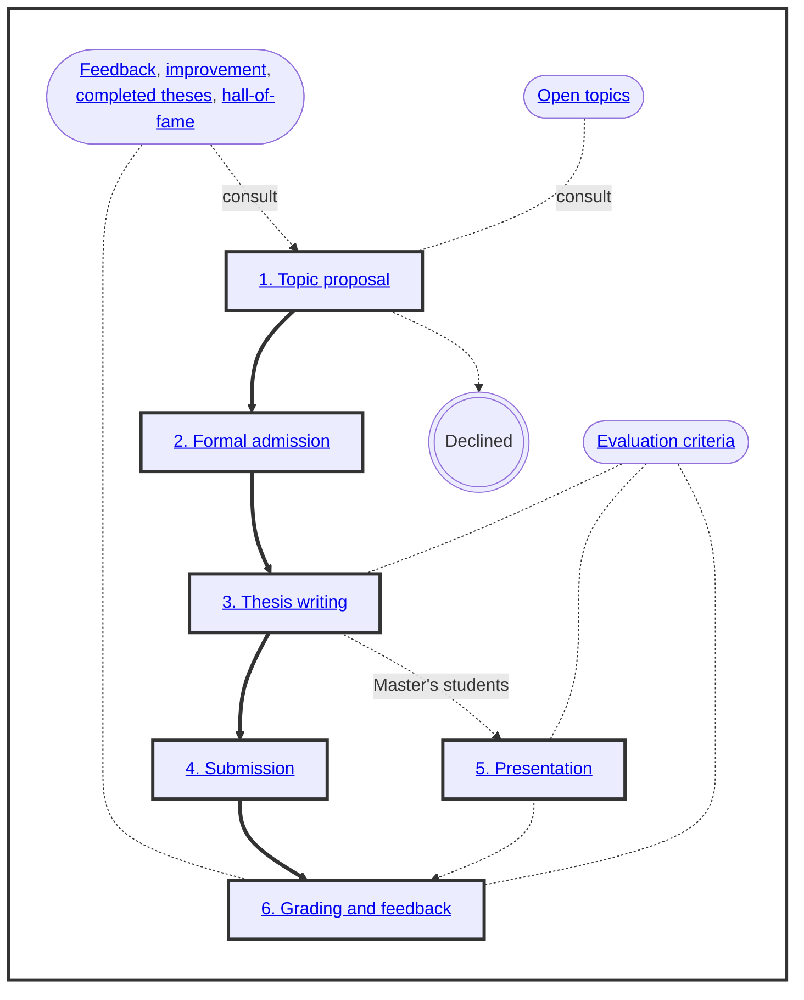
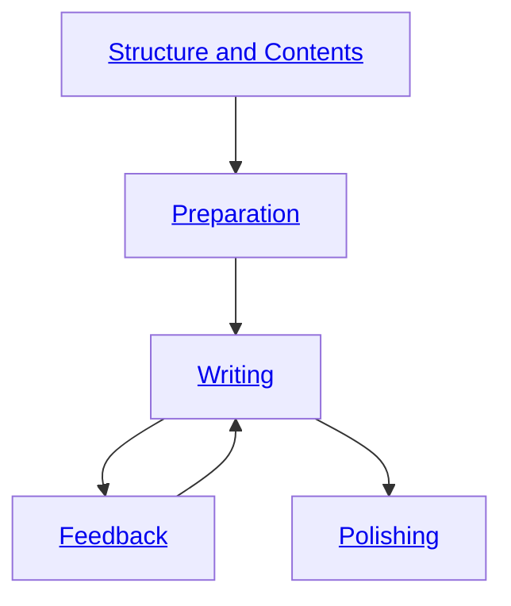

# Bachelor's and Master's Theses

 

 
-blue)
 
[-yellow)](https://digital-work-lab.github.io/theses/docs/feedback.html)

Welcome!
This page provides an overview and resources for writing a thesis in the area of [digital work](https://www.uni-bamberg.de/digital-work/){: target="_blank"}.
The thesis is one of the key accomplishments when studying at a University.
To support you throughout the process, we provide a clear overview of the steps, transparent evaluation criteria, as well as a developmental approach.

{: .text-center}

- A detailed overview of the administrative process is available [here](https://digital-work-lab.github.io/handbook/docs/30-teaching/30_processes/30.40.theses.html){: target="_blank"}.
- A changelog for this document is available [here](https://github.com/digital-work-lab/theses/commits/main/index.md){: target="_blank"}.

## 1. Topic proposal

We supervise theses on [predefined open topics](docs/topics.html) or topics suggested by students.

Given the high demand for thesis supervision, we cannot accommodate all proposals.
To ensure a fair and transparent process, decisions are made on a bi-monthly basis based on current capacities, alignment with our [research areas](https://digital-work-lab.github.io/handbook/docs/20-research/20_processes/20.01.goals.html), and the quality of the proposed topic.
Additionally, we consider whether students are at an advanced stage in their curriculum and need to finish their degree within a specific timeframe.
We review proposals on predefined dates (Feb-01, Apr-01, Jun-01, Aug-01, Oct-01, Dec-01) and decide whether to *Accept*, *Decline*, or invite a *Resubmission* with feedback provided to help refine the proposal if necessary.

<!-- 
For detailed criteria, refer to our research goals and processes.
- bi-monthly decision (Feb-01, Apr-01, Jun-01, Aug-01, Oct-01, Dec-01) - in line with capacities (link), criteria (fit with our research areas: digital work, distributed organizing, literature reviews - https://digital-work-lab.github.io/handbook/docs/20-research/20_processes/20.01.goals.html), outcomes: Accept, Decline, Reapply ()
-->

{: .text-center}

  
View current capacities

  
  
  
  

    {{ availability_content | markdownify }}
  

To start the process, create a repository from the [thesis template repository](https://github.com/digital-work-lab/thesis-template), give [geritwagner](https://github.com/geritwagner) (read) access, and schedule a meeting to discuss the topic:

{: .text-center}
[Schedule a meeting](https://calendly.com/gerit-wagner/30min){: .btn .btn-green target="_blank"}
{: .text-center}

To prepare the next step, it is recommended to start developing an [exposé](docs/expose.html).

- If you would like to receive notifications when we update the thesis resources, including the process or evaluation criteria, you can [watch](https://github.com/digital-work-lab/open-source-project/subscription){: target="_blank"} this repository.
- If this page is helpful for your work, please consider [starring](https://github.com/digital-work-lab/open-source-project){: target="_blank"} our repository.
- If you have any suggestions on how to improve it, please open an [issue](https://github.com/digital-work-lab/theses/issues/new){: target="_blank"} or pull request after suggesting changes (click on 'Help improve this page' at the bottom of the page you would like to change).

## 2. Formal admission

You send the **application for admission** to the thesis to the *examination office* via their Stud e-mail address.
You can use [this e-mail template](docs/admission_mail.html).

The examination office **verifies** the admission requirements.

- If admission requirements are met, the topic confirmation is created with text fields so that the topic of the thesis and the date of the topic issue can be entered.
- If the admission requirements are not met, you are notified that the application has been rejected.

The examination office may ask you to request **approval from the examination committee** (Prüfungsausschuss) to write a thesis in the area of *Digital Work*.
This is the case when older regulations (Studien- und Fachprüfungsordnung) apply (i.e., when master studies were started before 2018), or for students of Informatics and Applied Informatics (e.g., International Software Systems Science).

You **receive the topic confirmation** as a (protected) Word document (.docx) by e-mail together with processing/submission instructions as well as inspection statement.
The next step is to make an appointment with the thesis advisor to determine the topic and sign the topic confirmation.
Please upload the Word document to your thesis repository before the meeting.

You and your thesis advisor schedule a meeting to determine the topic and **sign the topic confirmation**.
If the topic was determined online or remotely, you can print and sign the confirmation, and send it to our [postal address](https://www.uni-bamberg.de/digital-work/team/prof-dr-gerit-wagner/){: target="_blank"}.
It is important that we receive **two paper versions with original signatures**:

- 1 original with two signatures (student and supervisor) **for the student**.
- 1 original with two signatures (student and supervisor) **for archiving at the chair**.

{: .info }
> To complete the admission, please add the topic and date in the Word document and upload it to your repository (or share it via e-mail).

## 3. Thesis writing and feedback sessions

Bachelor's theses are usually due in 4 months, Master's theses in 6 months.
The official requirements can be found in the regulations linked below.
It is not necessary to submit the thesis in the semester in which it was started (unless it would take longer than the maximum duration of study).
For students of *Applied Informatics*, *Software Systems Science*, and *Computing in the Humanities* a practical part is required for Bachelor's and Master's theses.

You are expected to complete the exposé before writing the thesis.
A thesis must be written in English.

We offer a comprehensive writing guide offering advice and best practices for all phases of your thesis:

{: .text-center}
[Writing Guide](docs/writing_section){: .btn .btn-green}
{: .text-center}

{: .text-center}

## 4. Submission of the thesis

Two copies in hardbound form (Klebe-/Hardcoverbindung, keine Spiralbindung oder Schnellhefter), including a CD with the digital Version on it in a paper cover in each copy taped onto the last page of the thesis, are to be submitted to the examination office.
The digital thesis has to be on a CD-ROM. It should contain the thesis as a PDF document and possibly a digital appendix.

{: .info }
> - It is mandatory to include a 💿 CD-ROM with a PDF of the thesis.
> - We provide CD-ROMs with paper covers free of charge—don’t spend 10€ at the copy shop! 😉 You can use the CIP-Pool computers to write data onto a CD-ROM.
> - You have to submit the declaration ("Einverständniserklärung zur Einsichtnahme einer unveröffentlichten Abschlussarbeit") as a separate document along with the thesis.
>   If you plan to publish a paper based on your thesis, it may be advisable to withhold your consent.

- During opening hours Mon-Fri 10.00 - 12.00: Hand in the thesis at the examination office (Kapuzinerstr. 25)
- Outside of opening hours: Drop the thesis in the mailbox of the University Administration (Kapuzinerstr. 16)
- Send it to the examination office via mail (the date of the postmark counts), Otto-Friedrich-University, Examination Office - 96045 Bamberg

{: .info }
> Purely digital submissions may become available in 2026.

## 5. Thesis presentation

Presentations are required for Master's theses.

- A template is available [here](assets/UB-Folienmaster.pptx) and [here](https://github.com/digital-work-lab/slides_template){: target="_blank"}.
- Evaluation criteria are stated [here](docs/evaluation.html#presentation).
- You decide whether the presentation should be scheduled before or after submitting the thesis. You can suggest a date for the presentation, and the thesis advisor selects a second examiner. Please schedule the presentation early and take into account our [availability](https://digital-work-lab.github.io/handbook/docs/02.calendar.html){: target="_blank"}.

## 6. Grading and feedback session

The thesis advisor (professor) grades the thesis based on the predefined [criteria](docs/evaluation.html). 
The examination office enters the grades.
You can check the grade via FlexNow.

Afterward, we provide feedback on the thesis and explain the grading.
A summary is stored on our [feedback page](docs/feedback.html) if you agree.

{: .text-center}
[Schedule feedback session](https://calendly.com/gerit-wagner/30min){: .btn .btn-green target="_blank"}
{: .text-center}

Next steps...

- 🥂 🎉 🎓 Remember to register for the [graduation ceremony](https://www.uni-bamberg.de/en/wiai/dekanat/graduation-ceremony/){: target="_blank"}
- ✉️ We are happy to support you with a [recommendation letter](https://digital-work-lab.github.io/handbook/docs/30-teaching/30_processes/30.70.recommendation_letters.html){: target="_blank"} — especially if you earned a good grade and showed strong engagement. Please reach out early!