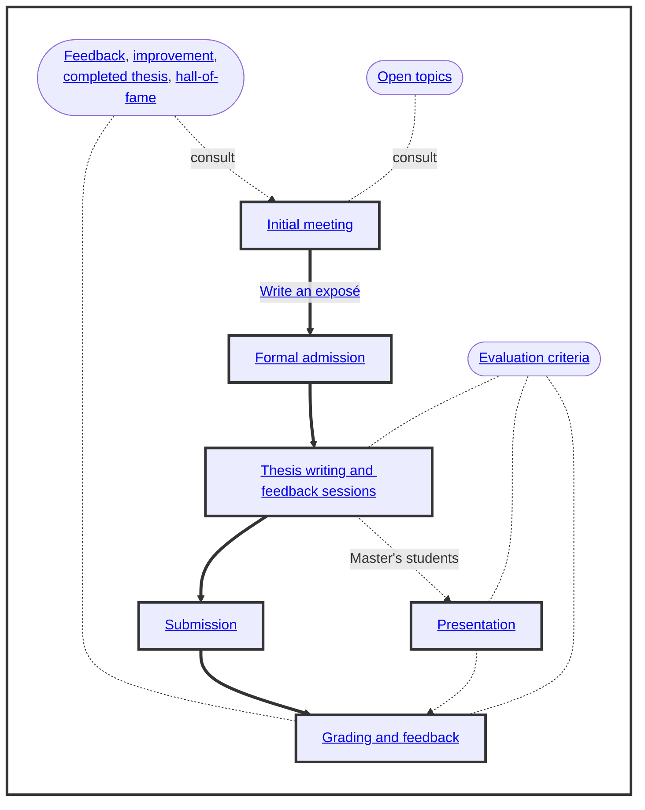

# Bachelor's and Master's Theses

 

 
-blue)
 
[-yellow)](https://digital-work-lab.github.io/theses/docs/feedback.html)

Welcome!
This page provides an overview and resources for writing a thesis in the area of [digital work](https://www.uni-bamberg.de/digital-work/){: target="_blank"}.
The thesis is one of the key accomplishments when studying at a University.
To support you throughout the process, we provide a clear overview of the steps, transparent evaluation criteria, as well as a developmental approach.

{: .text-center}

- A detailed overview of the administrative process is available [here](https://digital-work-lab.github.io/handbook/docs/30-teaching/30_processes/30.40.theses_process.html){: target="_blank"}.
- A changelog for this document is available [here](https://github.com/digital-work-lab/theses/commits/main/index.md){: target="_blank"}.

## 1. Initial meetings to discuss the topic

You can select [open topics](docs/topics.html) or suggest topics related to our research areas.
To start the process, reach out via e-mail and schedule a meeting to discuss topic and next steps:

{: .text-center}
[Schedule a meeting](https://calendly.com/gerit-wagner/30min){: .btn .btn-green target="_blank"}
{: .text-center}

To prepare the next step, it is recommended to start developing an [exposé](docs/expose.html).

- If you would like to receive notifications when we update the thesis resources, including the process or evaluation criteria, you can [watch](https://github.com/digital-work-lab/open-source-project/subscription){: target="_blank"} this repository.
- If this page is helpful for your work, please consider [starring](https://github.com/digital-work-lab/open-source-project){: target="_blank"} our repository.
- If you have any suggestions on how to improve it, please open an [issue](https://github.com/digital-work-lab/theses/issues/new){: target="_blank"} or pull request after suggesting changes (click on 'Help improve this page' at the bottom of the page you would like to change).

## 2. Formal admission

You send the **application for admission** to the thesis to the *examination office* via their Stud e-mail address.
You can use [this e-mail template](docs/admission_mail.html).

The examination office **verifies** the admission requirements.

- If admission requirements are met, the topic confirmation is created with text fields so that the topic of the thesis and the date of the topic issue can be entered.
- If the admission requirements are not met, you are notified that the application has been rejected.

The examination office may ask you to request an **approval from the examination committee** (Prüfungsausschuss) to write a thesis in the area of *Digital Work*.
This is the case when older regulations (Studien- und Fachprüfungsordnung) apply (i.e., when master studies were started before 2018), or for students of Informatics and Applied Informatics (e.g., International Software Systems Science).

You **receive the topic confirmation** as a (protected) Word document (.docx) by e-mail together with processing/submission instructions as well as inspection statement.
The next step is to make an appointment with the thesis advisor to determine the topic and sign the topic confirmation.
Please share the Word document with your thesis advisor shortly before the meeting.

You and your thesis advisor schedule a meeting to determine the topic and **sign the topic confirmation**.
If the appointment is online, you can print and sign the confirmation, and send it to our [postal address](https://www.uni-bamberg.de/digital-work/team/prof-dr-gerit-wagner/){: target="_blank"}.
It is important that we receive **two paper versions with original signatures**:

- 1 original with two signatures (student and supervisor) **for the student**.
- 1 original with two signatures (student and supervisor) **for archiving at the chair** .

## 3. Thesis writing and feedback sessions

Bachelor's theses are usually due in 4 months, Master's theses in 6 months.
The official requirements can be found in the regulations linked below.
It is not necessary to submit the thesis in the semester in which it was started (unless it would take longer than the maximum duration of study).
For students of Applied Informatics, Software Systems Science, and Computing in the Humanities a practical part is required for Bachelor's and Master's theses.

You are expected to complete the exposé before writing the thesis.
A thesis must be written in English.
The following resources may be helpful:

- The [evaluation criteria](docs/evaluation.html)
- The thesis template for [Markdown](https://github.com/digital-work-lab/thesis-template){: target="_blank"} ([create repository from template](https://github.com/new?template_name=thesis-template&template_owner=digital-work-lab){: target="_blank"}) <!-- or [word](https://raw.githubusercontent.com/digital-work-lab/handbook/main/assets/docs/template.docx) -->
- The [literature review section](https://digital-work-lab.github.io/handbook/docs/20-research/20_processes/20.10.literature-review.html){: target="_blank"}
- The [analysis templates section](https://digital-work-lab.github.io/handbook/docs/20-research/20_processes/20.21.analysis-templates.html){: target="_blank"}
- The [Bamberg Center for Empirical Studies (BACES)](https://www.uni-bamberg.de/baces/){: target="_blank"} offers free consultation related to data management and statistical analyses
- The [writing section](https://digital-work-lab.github.io/handbook/docs/20-research/20_processes/20.29.writing.html) (in particular correct citation practices)
- The [guideline for the use of digital tools](docs/digital_tools.html)
- Note: ethics statements cannot be issued for a thesis, but students are advised to consult the [ethics](https://www.uni-bamberg.de/gremien/senat-kommissionen/kommissionen/ethikrat/){: target="_blank"} page.

It is good practice to write the thesis in a Git-versioned repository, add notes from the meetings to the README.md file, and give your thesis advisor access to the repository.

{: .info }
Remember to create **regular backups** of your work, e.g., by creating Git versions and pushing them to a remote repository, and/or copying files to a USB stick.

We offer regular **feedback sessions** (every one to two weeks) to discuss open questions and the next steps:

- Feedback sessions can be in person or online
- They can be scheduled via [calendly](https://calendly.com/gerit-wagner/30min){: target="_blank"}

To receive feedback on the written document, please

- Share it 1-2 days before the meeting
- Indicate which sections should be read
- Use a file format suitable for adding comments (PDF or doc/x)
- Use a suitable filename (e.g., `2023-12-01-Thesis-Name.pdf`)

We expect you to communicate on an equal level:

- In e-mails, write `"Hallo Herr Wagner"` (instead of `"Sehr geehrter Herr Prof. Dr. Wagner"`).
- If you disagree with a particular suggestion, challenge it and explain why you would do it differently.
- Instead of apologizing, say [thank you](https://www.popsugar.com/smart-living/why-you-should-say-thank-you-instead-of-sorry-47250332){: target="_blank"}.

We encourage students to consult the [pre-submission checklist](docs/pre_submission.html) before submitting the thesis.

## 4. Submission of the thesis

Two copies in hardbound form (Klebe-/Hardcoverbindung, keine Spiralbindung oder Schnellhefter) including a CD with the digital Version on it in a paper cover in each copy taped onto the last page of the thesis are to be submitted to the examination office.

{: .warning }
You have to submit the declaration ("Einverständniserklärung zur Einsichtnahme einer unveröffentlichten Abschlussarbeit") as a separate document together with the thesis.

- During opening hours Mon-Fri 10.00 - 12.00: Hand in the thesis at the examination office (Kapuzinerstr. 25)
- Outside of opening hours: Drop the thesis in the mailbox of the University Administration (Kapuzinerstr. 16)
- Dispatch by mail (the date of the postmark counts) Otto-Friedrich-University, Examination Office - 96045 Bamberg

The digital thesis has to be on a CD-ROM. It should contain the thesis as a PDF document and possibly a digital appendix.

## 5. Thesis presentation

- You present your Master's thesis.
- Evaluation criteria are stated [here](docs/evaluation.html#presentation).
- You can suggest a date for the presentation (before or after submitting the thesis) and the thesis advisor selects a second examiner.

## 6. Grading and feedback session

The thesis advisor (professor) grades the thesis based on the predefined [criteria](docs/evaluation.html). 
The examination office enters the grades.
You can check the grade via FlexNow.

Afterward, we provide feedback on the thesis and explain the grading.
A summary is stored on our [feedback page](docs/feedback.html) if you agree.

{: .text-center}
[Schedule feedback session](https://calendly.com/gerit-wagner/30min){: .btn .btn-green target="_blank"}
{: .text-center}

## Applicable regulations

<!-- 
- Bachelor Business Information Systems
- Bachelor International Information Systems Management
- Bachelor Angewandte Informatik
- Bachelor Software Systems Science
- Master Business Information Systems
- Master International Information Systems Management
- Master Angewandte Informatik
- Master Software Systems Science
- Master Computing in the Humanities
 -->

- [Prüfungs- und Studienordnungen](https://www.uni-bamberg.de/abt-studium/aufgaben/pruefungs-studienordnungen/){: target="_blank"}, insbes. Modulhandbücher
